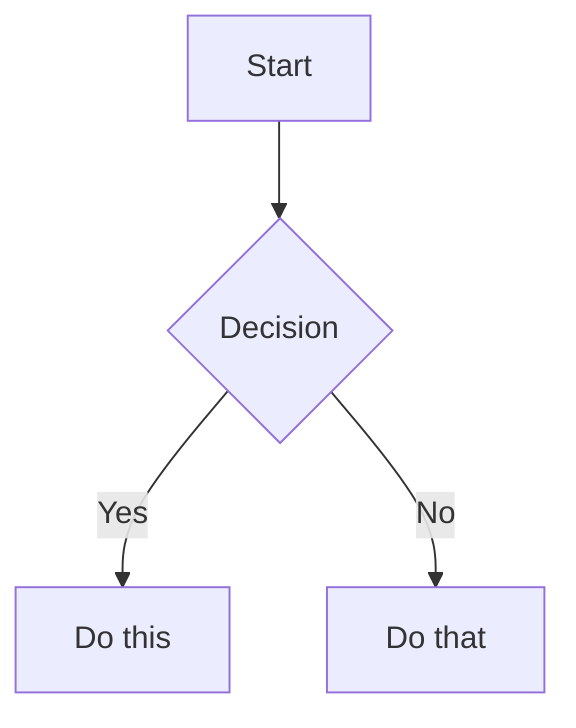

# Obsidian Flavored Markdown Skill

Create and edit valid Obsidian notes using standard Markdown for links and media. Obsidian-specific features such as callouts, properties, comments, highlights, math, and Mermaid are available when useful. Standard Markdown (headings, bold, italic, lists, quotes, code blocks, and tables) is assumed knowledge.

## Vault Conventions

- Do not use Obsidian Wiki links or Wiki embeds.
- Link to another note with a relative standard Markdown path, for example `[Project plan](../Projects/project-plan.md)`.
- Link to a heading with a standard Markdown fragment, for example `[Decisions](../Projects/project-plan.md#decisions)`.
- New images, PDFs, audio, and other attachments must follow the required Custom Attachment Location layout below. This is a vault requirement, not a naming preference.
- Link to PDFs, audio, Bases, and other attachments with standard Markdown links. Do not transclude notes or Bases inline.

## Required Attachment Layout

This vault uses the [Custom Attachment Location](https://github.com/mnaoumov/obsidian-custom-attachment-location) plugin. Its configured patterns are authoritative for every new attachment:

| Plugin setting | Required value |
|---|---|
| New attachment location | `./assets/${noteFileName}` |
| Markdown URL format | `assets/${noteFileName}/${generatedAttachmentFileName}` |
| Generated attachment file name | `file-${date:{momentJsFormat:'YYYYMMDDHHmmssSSS'}}` |

- `${noteFileName}` is the note's filename without `.md`; the attachment directory is relative to that note's directory.
- `${generatedAttachmentFileName}` is the generated file's actual name, including its extension. Use it unchanged in the Markdown link.
- When adding an attachment manually, use the same `file-YYYYMMDDHHmmssSSS.<extension>` naming pattern and place it in the matching `assets/<note-file-name>/` directory.

For example, an attachment added to `research-notes.md` as `file-20260913012345678.png` must be stored and linked as:

```markdown

```

## Workflow: Creating an Obsidian Note

1. **Add frontmatter** with properties (title, tags, aliases) at the top of the file. See [PROPERTIES.md](references/PROPERTIES.md) for all property types.
2. **Write content** using standard Markdown for structure, plus Obsidian-specific syntax below.
3. **Link related notes and attachments** with relative standard Markdown paths. See [EMBEDS.md](references/EMBEDS.md) for permitted media and attachment patterns.
4. **Add local attachments** using the required attachment layout. Embed images with standard Markdown image syntax, and link to other attachment types with standard Markdown links.
5. **Add callouts** for highlighted information using `> [!type]` syntax. See [CALLOUTS.md](references/CALLOUTS.md) for all callout types.
6. **Verify** the note renders correctly in Obsidian's reading view.

## Internal Links and Media

```markdown
[Project plan](../Projects/project-plan.md)             Link to another note
[Project decisions](../Projects/project-plan.md#decisions) Link to a heading
[Open the source PDF](assets/research-notes/source.pdf) Link to an attachment
     Embed a local image
```

Use a descriptive Markdown link for notes, PDFs, audio, Bases, and other attachments. Standard Markdown has no transclusion equivalent for a note or Base, so link to it rather than embedding it.

See [EMBEDS.md](references/EMBEDS.md) for permitted media and attachment patterns.

## Callouts

```markdown
> [!note]
> Basic callout.

> [!warning] Custom Title
> Callout with a custom title.

> [!faq]- Collapsed by default
> Foldable callout (- collapsed, + expanded).
```

Common types: `note`, `tip`, `warning`, `info`, `example`, `quote`, `bug`, `danger`, `success`, `failure`, `question`, `abstract`, `todo`.

See [CALLOUTS.md](references/CALLOUTS.md) for the full list with aliases, nesting, and custom CSS callouts.

## Properties (Frontmatter)

```yaml
---
title: My Note
date: 2024-01-15
tags:
  - project
  - active
aliases:
  - Alternative Name
cssclasses:
  - custom-class
---
```

Default properties: `tags` (searchable labels), `aliases` (alternative note names for link suggestions), `cssclasses` (CSS classes for styling).

See [PROPERTIES.md](references/PROPERTIES.md) for all property types, tag syntax rules, and advanced usage.

## Tags

```markdown
#tag                    Inline tag
#nested/tag             Nested tag with hierarchy
```

Tags can contain letters, numbers (not first character), underscores, hyphens, and forward slashes. Tags can also be defined in frontmatter under the `tags` property.

## Comments

```markdown
This is visible %%but this is hidden%% text.

%%
This entire block is hidden in reading view.
%%
```

## Obsidian-Specific Formatting

```markdown
==Highlighted text==                   Highlight syntax
```

## Math (LaTeX)

```markdown
Inline: $e^{i\pi} + 1 = 0$

Block:
$$
\frac{a}{b} = c
$$
```

## Diagrams (Mermaid)

````markdown

````

## Footnotes

```markdown
Text with a footnote[^1].

[^1]: Footnote content.

Inline footnote.^[This is inline.]
```

## Complete Example

````markdown
---
title: Project Alpha
date: 2024-01-15
tags:
  - project
  - active
status: in-progress
---

# Project Alpha

This project aims to [improve workflow](improve-workflow.md) using modern techniques.

> [!important] Key Deadline
> The first milestone is due on ==January 30th==.

## Tasks

- [x] Initial planning
- [ ] Development phase
  - [ ] Backend implementation
  - [ ] Frontend design

## Notes

The algorithm uses $O(n \log n)$ sorting. See [sorting notes](algorithm-notes.md#sorting) for details.


Reviewed in [the meeting decisions](meeting-notes-2024-01-10.md#decisions).
````

## References

- [Obsidian Flavored Markdown](https://help.obsidian.md/obsidian-flavored-markdown)
- [Internal links](https://help.obsidian.md/links)
- [Embed files](https://help.obsidian.md/embeds)
- [Callouts](https://help.obsidian.md/callouts)
- [Properties](https://help.obsidian.md/properties)
