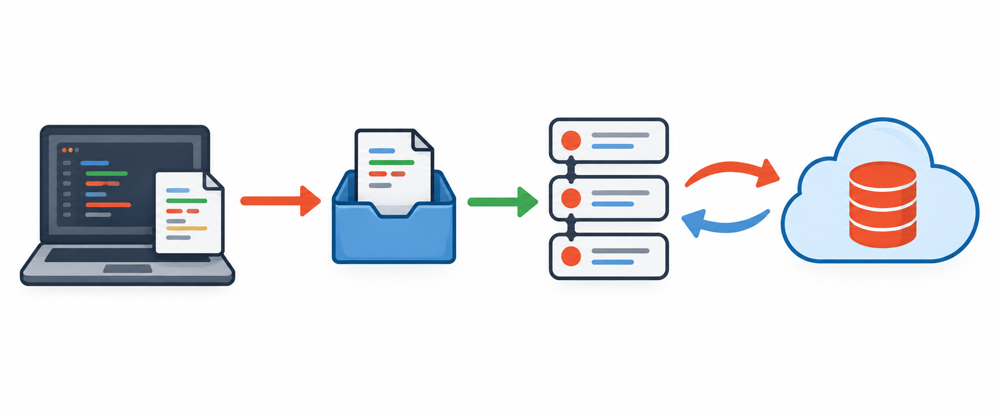

# Git 学习索引

Git 是**分布式版本控制系统**：每个克隆下来的仓库都保存完整历史。日常使用时，把它看作「记录代码变化、用分支隔离工作、与远程仓库同步」的工具即可。



上图从左到右依次表示：工作区的修改、暂存区、本地提交历史，以及远程仓库；本地与远程之间可以双向同步。

## 阅读顺序

1. [基础与仓库操作](01_Git基础与仓库操作.md)：先认识仓库、状态和忽略规则。
2. [提交与撤销](02_提交与撤销.md)：把改动安全地提交、修改或撤回。
3. [分支、合并与冲突](03_分支合并与冲突.md)：在不影响主线的前提下开发功能。
4. [远程协作与实用排查](04_远程协作与实用排查.md)：同步远程、标签和常见问题。
5. [常用指令速查](05_Git常用指令速查.md)：按任务快速找到需要的命令。
6. [.gitignore 规则与实践](06_gitignore规则与实践.md)：避免把本地文件、构建产物和敏感信息纳入版本控制。

## 三个核心区域

| 区域                        | 含义           | 常用命令                                |
| ------------------------- | ------------ | ----------------------------------- |
| 工作区（working tree）         | 文件在磁盘上的当前状态  | `git status`、`git diff`             |
| 暂存区（staging area / index） | 下一次提交准备包含的内容 | `git add`、`git restore --staged`    |
| 本地仓库（repository）          | 已提交的版本历史     | `git commit`、`git log`、`git switch` |

远程仓库不是第四个本地区域，而是另一个仓库的引用。`git fetch` 会下载远程历史，`git push` 会上传本地提交。

> [!tip] 先看状态，再执行命令
> 不确定时先运行 `git status`；需要比较修改时再运行 `git diff`。这两个命令不会改动文件，是最安全的起点。

## 一次功能开发的最小流程

```bash
# 先同步主线，再从主线开功能分支
git switch main
git pull --ff-only
git switch -c feat/short-description

# 开发后提交
git status
git add <文件路径>
git commit -m "feat: 简要说明变更"

# 首次推送时建立上游关联
git push -u origin feat/short-description
```

提交前可用 `git diff --staged` 核对即将提交的内容；推送前确认自己位于正确的分支。

## 记忆要点

- `add` 是「挑选要提交的内容」，不是保存全部工作区。
- `commit` 只写入本地历史；`push` 才会把提交发送到远程。
- 公共分支上已经推送的提交，优先用 `git revert` 反向提交，不要轻易改写历史。
- 删除、覆盖、重置前先用 `git status`、`git diff` 或创建一个临时分支保留现场。
