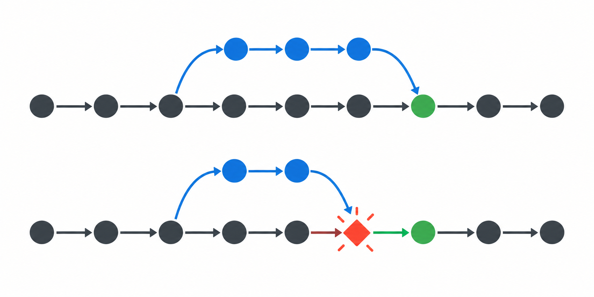

# Git 分支、合并与冲突

返回 [Git 学习索引](00_Git学习索引.md)。分支是指向某个提交的可移动名称；创建分支很轻量，适合为每个独立功能或修复建立隔离的工作线。



上半部分是无冲突合并；下半部分表示修改重叠时，先解决冲突，再形成合并结果。

## 创建、查看与切换分支

```bash
# 从当前提交创建并切换到新分支
git switch -c feat/export-report

# 查看本地与远程分支；-vv 同时显示上游关系
git branch -vv
git branch -a

# 切换已有分支
git switch main

# 删除已经合并的本地分支
git branch -d feat/export-report
```

如果分支尚未合并，`git branch -d` 会拒绝删除；只有确认不需要时才使用强制删除 `git branch -D <分支名>`。

## `merge` 与 `rebase` 的区别

假设你正在 `feat/export-report`，需要同步 `main` 的最新改动：

```bash
git fetch origin
git merge origin/main
```

`merge` 将两个历史汇合，必要时生成一个合并提交；它不会改写现有提交，适合共享分支。

```bash
git fetch origin
git rebase origin/main
```

`rebase` 会把当前分支的提交接到目标分支最新提交之后，让历史更线性，但会改写当前分支提交的 ID。对于已经被他人基于其开发的分支，不要自行 rebase 后强推。

| 情况 | 推荐 |
| --- | --- |
| 合并共享分支、保留真实分叉历史 | `merge` |
| 整理自己尚未共享的功能分支 | `rebase` |
| 已推送的公共提交需要“撤回” | `revert`，而非 rebase 或 reset |

## 合并功能分支到主线

```bash
git switch main
git pull --ff-only
git merge --no-ff feat/export-report
git push origin main
```

`--no-ff` 即使可以快进也创建合并提交，能在历史中保留功能分支边界；是否使用取决于团队约定。多数团队会通过 Pull Request / Merge Request 在平台页面完成这一步。

## 解决冲突

出现冲突时，Git 会暂停操作并在文件中标记冲突段：

```text
<<<<<<< HEAD
当前分支的内容
=======
要合入内容的内容
>>>>>>> other-branch
```

处理顺序：

1. 运行 `git status`，确认哪些文件冲突。
2. 打开冲突文件，理解两侧的意图，手工保留正确的最终内容并删除所有标记行。
3. 运行测试或至少检查受影响功能。
4. `git add <已解决文件>`，表示该文件的冲突已经解决。
5. 继续被暂停的操作：合并时运行 `git commit`；变基时运行 `git rebase --continue`。

```bash
# 放弃这次合并或变基，回到开始前
git merge --abort
git rebase --abort
```

> [!tip] 冲突不是错误提示，而是需要人做决策的信号
> Git 无法判断两处改动应如何组合。不要机械地选择“当前”或“传入”版本；应以最终行为正确、测试通过为准。

## 同时维护两项工作：`worktree`

一个仓库可以关联多个工作目录，避免为了临时修复而反复 stash：

```bash
# 在相邻目录创建一个指向现有/新分支的工作目录
git worktree add ../project-hotfix -b hotfix/login-timeout

# 查看和清理已不再需要的工作目录
git worktree list
git worktree remove ../project-hotfix
```

每个工作目录只能检出一个分支；同一个分支通常不能同时被两个 worktree 检出。

下一篇：[远程协作与实用排查](04_远程协作与实用排查.md)。
