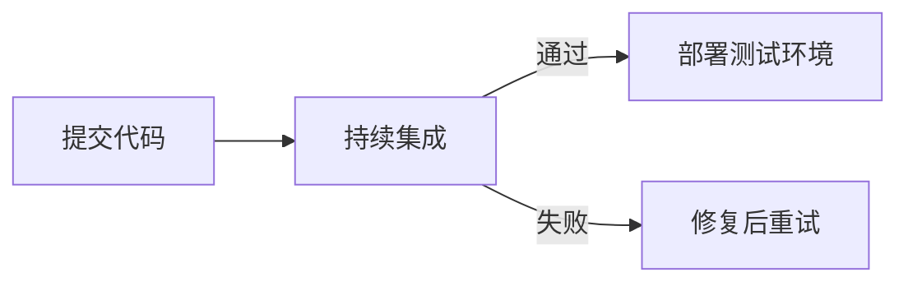
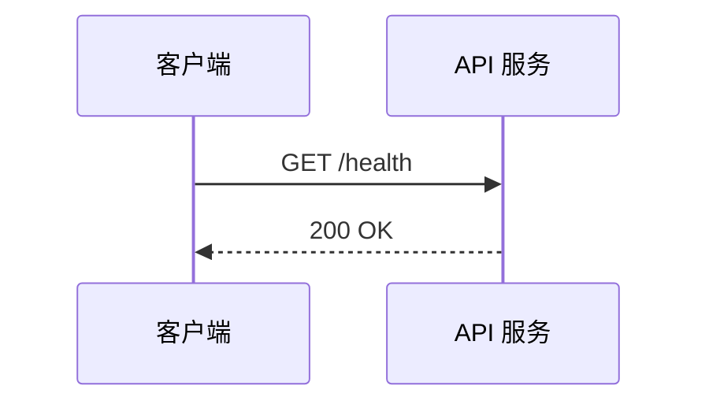

# 行内公式

欧拉公式：$e^{i\pi} + 1 = 0$。

```md
欧拉公式：$e^{i\pi} + 1 = 0$。
```

## 块级公式

$$
T(n) = O(n \log n)
$$

```md
$$
T(n) = O(n \log n)
$$
```

## 常用公式符号

$$
\frac{a}{b}, \quad x^2, \quad x_i, \quad \sum_{i=1}^{n} i
$$

```md
$$
\frac{a}{b}, \quad x^2, \quad x_i, \quad \sum_{i=1}^{n} i
$$
```

> [!warning] 公式兼容性
> LaTeX 公式依赖 KaTeX、MathJax 或目标平台的等效能力，不属于最小 Markdown 语法。发布到 GitHub、文档站或聊天系统前，应预览确认。

## Mermaid 流程图



````md

````

## Mermaid 时序图



````md

````

## 脚注

此功能依赖 Node.js 版本。[^node]

[^node]: 请以项目的 `.nvmrc`、`package.json` 或 CI 配置为准。

```md
此功能依赖 Node.js 版本。[^node]

[^node]: 请以项目的 `.nvmrc`、`package.json` 或 CI 配置为准。
```

## 行内脚注

接口已废弃。^[新代码请使用 `/v2/users`。]

```md
接口已废弃。^[新代码请使用 `/v2/users`。]
```

> [!note] 脚注差异
> `[^id]` 是 GFM 和 Obsidian 都常见的脚注形式；`^[文字]` 是 Obsidian 的行内脚注。面向多平台发布时优先使用前者。
