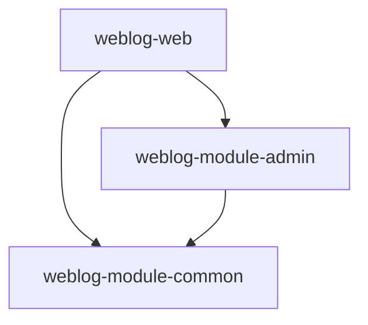

## 1. Spring Boot 启动类的位置与作用


### 1.1 为什么启动入口在 `weblog-web` 模块？

#### 常见误解
❌ **错误认知**：因为 `weblog-web` 在 `<modules>` 中排在最上面，所以是入口

#### 正确理解
✅ **真正原因**：`weblog-web` 模块满足以下三个条件：

| 条件 | 说明 | 本项目示例 |
|------|------|-----------|
| **包含启动类** | 有 `@SpringBootApplication` 注解的类 | `WeblogWebApplication.java` |
| **依赖其他模块** | 在 `pom.xml` 中依赖了 `admin` 和 `common` | 见下方代码 |
| **配置打包插件** | 配置了 `spring-boot-maven-plugin` | 见下方代码 |

#### 本项目实际配置

**`weblog-web/pom.xml`**：
```xml
<dependencies>
    <!-- 依赖通用模块 -->
    <dependency>
        <groupId>com.shangqh</groupId>
        <artifactId>weblog-module-common</artifactId>
    </dependency>
    <!-- 依赖管理后台模块 -->
    <dependency>
        <groupId>com.shangqh</groupId>
        <artifactId>weblog-module-admin</artifactId>
    </dependency>
    <!-- Web 依赖 -->
    <dependency>
        <groupId>org.springframework.boot</groupId>
        <artifactId>spring-boot-starter-web</artifactId>
    </dependency>
</dependencies>

<build>
    <plugins>
        <!-- Spring Boot 打包插件 -->
        <plugin>
            <groupId>org.springframework.boot</groupId>
            <artifactId>spring-boot-maven-plugin</artifactId>
        </plugin>
    </plugins>
</build>
```

### 1.2 启动类的作用

启动类是 Spring Boot 应用的**入口点**，负责：
- 启动 Spring 容器（IoC 容器）
- 扫描并注册所有 Bean
- 启动内嵌 Web 服务器（如 Tomcat）
- 监听端口，接收请求

### 1.3 启动类的位置约定

```
weblog-web/src/main/java/com/shangqh/weblog/web/
├── WeblogWebApplication.java    ← 启动类放在根包下
├── controller/                   ← 控制器放在子包
├── service/                      ← 服务放在子包
└── ...
```

**为什么放在根包下？**
- `@SpringBootApplication` 包含 `@ComponentScan`
- 默认扫描**当前包及其子包**下的所有组件
- 放在根包下可以扫描到所有子包中的组件

---

## 2. `@SpringBootApplication` 注解详解

### 2.1 注解的组成

`@SpringBootApplication` 是一个**组合注解**，包含三个核心注解：

```java
@SpringBootConfiguration      // 1. 标识这是一个配置类
@EnableAutoConfiguration      // 2. 启用自动配置
@ComponentScan                // 3. 自动扫描组件
public @interface SpringBootApplication {
    // ...
}
```

### 2.2 各注解的功能

| 注解 | 功能 | 类比 |
|------|------|------|
| `@SpringBootConfiguration` | 标识这是一个配置类，可以定义 Bean | 相当于 `@Configuration` |
| `@EnableAutoConfiguration` | 根据 classpath 中的依赖自动配置 Spring 应用 | 自动配置 Tomcat、Spring MVC 等 |
| `@ComponentScan` | 自动扫描并注册带有 `@Component`、`@Service`、`@Controller` 等注解的类 | 自动发现并注册 Bean |

### 2.3 本项目启动类

```java
package com.shangqh.weblog.web;

import org.springframework.boot.SpringApplication;
import org.springframework.boot.autoconfigure.SpringBootApplication;

@SpringBootApplication  // ← 核心注解
public class WeblogWebApplication {

    public static void main(String[] args) {
        SpringApplication.run(WeblogWebApplication.class, args);
    }

}
```

### 2.4 自动配置的"魔法"

当你添加 `spring-boot-starter-web` 依赖时，`@EnableAutoConfiguration` 会自动配置：

| 依赖 | 自动配置的内容 |
|------|---------------|
| `spring-boot-starter-web` | Spring MVC、内嵌 Tomcat、JSON 序列化 |
| `spring-boot-starter-data-jpa` | 数据源、JPA、Hibernate |
| `spring-boot-starter-security` | 安全认证、授权 |

**原理**：Spring Boot 根据 classpath 中的依赖，自动推断需要配置什么。

---

## 3. `main` 方法与 `SpringApplication.run()`

### 3.1 `main` 方法的作用

```java
public static void main(String[] args) {
    SpringApplication.run(WeblogWebApplication.class, args);
}
```

| 部分 | 作用 |
|------|------|
| `public static void main(String[] args)` | Java 程序的标准入口 |
| `SpringApplication.run(...)` | 启动 Spring Boot 应用 |
| `WeblogWebApplication.class` | 告诉 Spring Boot 主配置类是哪个 |
| `args` | 接收命令行参数（如 `--server.port=8081`） |

### 3.2 `SpringApplication.run()` 的执行流程

```
1. 创建 SpringApplication 实例
   ↓
2. 推断应用类型（Servlet/Reactive）
   ↓
3. 加载 ApplicationContextInitializer
   ↓
4. 加载 ApplicationListener
   ↓
5. 推断主配置类（WeblogWebApplication.class）
   ↓
6. 创建 Spring 应用上下文（IoC 容器）
   ↓
7. 扫描并注册所有 Bean
   ↓
8. 启动内嵌 Web 服务器（Tomcat）
   ↓
9. 监听端口（默认 8080）
   ↓
10. 应用就绪，等待请求
```

### 3.3 命令行参数的使用

```bash
# 启动时指定端口
java -jar weblog-web.jar --server.port=8081

# 启动时指定配置文件
java -jar weblog-web.jar --spring.profiles.active=prod
```

在代码中获取参数：
```java
public static void main(String[] args) {
    SpringApplication.run(WeblogWebApplication.class, args);
    // args 包含命令行参数
}
```

---

## 4. Maven 多模块项目中启动类的识别机制

### 4.1 模块顺序不影响启动入口

#### 常见误解
❌ **错误认知**：`<modules>` 中排在前面的模块是入口

#### 正确理解
✅ **真正原因**：模块顺序只是 Maven 构建时的顺序，不影响启动入口

```xml
<!-- 父工程 pom.xml -->
<modules>
    <module>weblog-web</module>        <!-- 放在这里不代表它是入口 -->
    <module>weblog-module-admin</module>
    <module>weblog-module-common</module>
</modules>
```

**实验验证**：
```xml
<!-- 即使把 weblog-web 放在最后 -->
<modules>
    <module>weblog-module-admin</module>
    <module>weblog-module-common</module>
    <module>weblog-web</module>  <!-- 仍然是入口 -->
</modules>
```

**结果**：项目仍然可以正常启动，启动入口仍然是 `weblog-web`。

### 4.2 Maven 构建顺序的决定因素

Maven 根据**依赖关系**自动决定构建顺序：

```
weblog-module-common  ← 被依赖，先构建
        ↑
weblog-module-admin   ← 被依赖，先构建
        ↑
weblog-web            ← 依赖其他模块，最后构建
```

**依赖关系图**：


### 4.3 启动类识别的真正标准

| 因素 | 是否决定启动类 | 说明 |
|------|---------------|------|
| 模块在 `<modules>` 中的顺序 | ❌ 否 | 只是构建顺序 |
| 配置了 `spring-boot-maven-plugin` | ❌ 否 | 只是打包工具 |
| 依赖其他模块 | ❌ 否 | 只是依赖关系 |
| `@SpringBootApplication` 注解 | ✅ 是 | 标识启动类 |
| `main` 方法 | ✅ 是 | Java 程序入口 |

---

## 5. `spring-boot-maven-plugin` 插件

### 5.1 插件的作用

```xml
<plugin>
    <groupId>org.springframework.boot</groupId>
    <artifactId>spring-boot-maven-plugin</artifactId>
</plugin>
```

| 功能 | 说明 |
|------|------|
| **打包可执行 JAR** | 将项目打包成可以直接运行的 JAR 文件 |
| **内嵌 Web 服务器** | 将 Tomcat/Jetty 等服务器打包进 JAR |
| **提供 `mvn spring-boot:run` 命令** | 可以直接在 IDE 中运行 Spring Boot 应用 |
| **排除特定依赖** | 可以排除不需要的依赖（如 Lombok） |

### 5.2 父工程中的插件管理

```xml
<!-- 父工程 pom.xml -->
<build>
    <pluginManagement>
        <plugins>
            <plugin>
                <groupId>org.springframework.boot</groupId>
                <artifactId>spring-boot-maven-plugin</artifactId>
                <configuration>
                    <excludes>
                        <!-- 打包时排除 Lombok -->
                        <exclude>
                            <groupId>org.projectlombok</groupId>
                            <artifactId>lombok</artifactId>
                        </exclude>
                    </excludes>
                </configuration>
            </plugin>
        </plugins>
    </pluginManagement>
</build>
```

### 5.3 子模块中的插件配置

```xml
<!-- weblog-web/pom.xml -->
<build>
    <plugins>
        <plugin>
            <groupId>org.springframework.boot</groupId>
            <artifactId>spring-boot-maven-plugin</artifactId>
        </plugin>
    </plugins>
</build>
```

### 5.4 没有这个插件会怎样？

| 情况 | 结果 |
|------|------|
| 没有 `spring-boot-maven-plugin` | 项目仍然可以编译和运行，但无法打包成可执行 JAR |
| 有 `spring-boot-maven-plugin` | 可以打包成可执行 JAR，包含内嵌 Tomcat |

---

## 6. 启动类的创建时机

### 6.1 自动创建（推荐）

#### 使用 Spring Initializr 创建项目

**方式一：在线创建**
1. 访问 [start.spring.io](https://start.spring.io)
2. 填写项目信息（Group、Artifact、包名等）
3. 选择依赖（如 Spring Web）
4. 点击生成，下载 ZIP 文件
5. 解压后，启动类已经生成好了

**方式二：IDEA 插件**
1. File → New → Project
2. 选择 Spring Initializr
3. 填写项目信息
4. 选择依赖
5. 点击 Finish，启动类自动生成

#### 生成的启动类
```java
package com.shangqh.weblog.web;

import org.springframework.boot.SpringApplication;
import org.springframework.boot.autoconfigure.SpringBootApplication;

@SpringBootApplication
public class WeblogWebApplication {

    public static void main(String[] args) {
        SpringApplication.run(WeblogWebApplication.class, args);
    }

}
```

### 6.2 手动创建

如果需要手动创建启动类，需要：

1. **创建类**：在根包下创建一个类
2. **添加注解**：加上 `@SpringBootApplication`
3. **添加 `main` 方法**：调用 `SpringApplication.run()`

```java
package com.shangqh.weblog.web;

import org.springframework.boot.SpringApplication;
import org.springframework.boot.autoconfigure.SpringBootApplication;

@SpringBootApplication
public class WeblogWebApplication {

    public static void main(String[] args) {
        SpringApplication.run(WeblogWebApplication.class, args);
    }

}
```

### 6.3 创建时机对比

| 时机 | 操作 | 结果 |
|------|------|------|
| **项目创建时** | 使用 Spring Initializr 创建项目 | 自动生成启动类 |
| **手动创建** | 自己编写启动类 | 需要手动添加注解和 `main` 方法 |
| **`package` 时** | Maven 打包 | 只是编译和打包，不生成启动类 |

---

## 7. Maven 父子工程依赖管理

### 7.1 父工程的作用

```xml
<!-- 父工程 pom.xml -->
<parent>
    <groupId>org.springframework.boot</groupId>
    <artifactId>spring-boot-starter-parent</artifactId>
    <version>2.6.3</version>
</parent>

<groupId>com.shangqh</groupId>
<artifactId>weblog-springboot</artifactId>
<version>${revision}</version>
<packaging>pom</packaging>

<modules>
    <module>weblog-web</module>
    <module>weblog-module-admin</module>
    <module>weblog-module-common</module>
</modules>
```

**父工程的作用**：
- 统一管理依赖版本
- 统一管理插件配置
- 统一管理项目属性
- 定义子模块

### 7.2 依赖管理

```xml
<!-- 父工程 pom.xml -->
<dependencyManagement>
    <dependencies>
        <dependency>
            <groupId>com.shangqh</groupId>
            <artifactId>weblog-module-admin</artifactId>
            <version>0.0.1-SNAPSHOT</version>
        </dependency>
        <dependency>
            <groupId>com.shangqh</groupId>
            <artifactId>weblog-module-common</artifactId>
            <version>0.0.1-SNAPSHOT</version>
        </dependency>
    </dependencies>
</dependencyManagement>
```

**作用**：
- 在父工程中定义依赖版本
- 子模块中不需要指定版本号
- 统一管理，避免版本冲突

### 7.3 子模块的依赖

```xml
<!-- weblog-web/pom.xml -->
<dependencies>
    <dependency>
        <groupId>com.shangqh</groupId>
        <artifactId>weblog-module-common</artifactId>
        <!-- 不需要指定版本号，继承父工程 -->
    </dependency>
    <dependency>
        <groupId>com.shangqh</groupId>
        <artifactId>weblog-module-admin</artifactId>
        <!-- 不需要指定版本号，继承父工程 -->
    </dependency>
</dependencies>
```

### 7.4 版本号统一管理

```xml
<!-- 父工程 pom.xml -->
<properties>
    <!-- 项目版本号 -->
    <revision>0.0.1-SNAPSHOT</revision>
    <java.version>1.8</java.version>
    
    <!-- 依赖包版本 -->
    <lombok.version>1.18.28</lombok.version>
    <guava.version>31.1-jre</guava.version>
    <commons-lang3.version>3.12.0</commons-lang3.version>
</properties>
```

**好处**：
- 统一修改版本号
- 避免版本冲突
- 便于维护

---

## 8. 常见误解与易错点

### 8.1 误解一：模块顺序决定启动入口

❌ **错误认知**：`<modules>` 中排在前面的模块是入口

✅ **正确理解**：模块顺序只是构建顺序，不影响启动入口

### 8.2 误解二：配置了 `spring-boot-maven-plugin` 就是启动类

❌ **错误认知**：配置了 `spring-boot-maven-plugin` 的模块就是启动类

✅ **正确理解**：`spring-boot-maven-plugin` 只是打包工具，不决定启动类

### 8.3 误解三：依赖其他模块就是启动类

❌ **错误认知**：依赖其他模块的模块就是启动类

✅ **正确理解**：依赖关系只是架构设计，不决定启动类

### 8.4 误解四：启动类是 `package` 时生成的

❌ **错误认知**：启动类是 Maven `package` 时自动生成的

✅ **正确理解**：启动类是项目创建时生成的（Spring Initializr），`package` 只是编译和打包

### 8.5 易错点总结

| 易错点 | 说明 | 解决方案 |
|--------|------|---------|
| 启动类位置不对 | 启动类没有放在根包下 | 将启动类放在根包下 |
| 缺少 `@SpringBootApplication` | 启动类没有加注解 | 添加 `@SpringBootApplication` 注解 |
| 缺少 `main` 方法 | 启动类没有 `main` 方法 | 添加 `main` 方法 |
| 依赖版本冲突 | 多个模块依赖不同版本 | 在父工程中统一管理版本 |
| 打包失败 | 没有配置 `spring-boot-maven-plugin` | 在子模块中配置插件 |

---

## 9. 快速回顾要点

### 9.1 核心概念

| 概念 | 要点 |
|------|------|
| **启动类** | 带有 `@SpringBootApplication` 注解和 `main` 方法的类 |
| **启动入口** | 由启动类决定，与模块顺序无关 |
| **`@SpringBootApplication`** | 组合注解，包含 `@Configuration`、`@EnableAutoConfiguration`、`@ComponentScan` |
| **`SpringApplication.run()`** | 启动 Spring Boot 应用，创建 IoC 容器，启动 Web 服务器 |
| **`spring-boot-maven-plugin`** | 打包可执行 JAR，不决定启动类 |
| **Maven 多模块** | 父工程统一管理依赖，子模块继承配置 |

### 9.2 关键代码

**启动类**：
```java
@SpringBootApplication
public class WeblogWebApplication {
    public static void main(String[] args) {
        SpringApplication.run(WeblogWebApplication.class, args);
    }
}
```

**父工程 `pom.xml`**：
```xml
<parent>
    <groupId>org.springframework.boot</groupId>
    <artifactId>spring-boot-starter-parent</artifactId>
    <version>2.6.3</version>
</parent>

<modules>
    <module>weblog-web</module>
    <module>weblog-module-admin</module>
    <module>weblog-module-common</module>
</modules>
```

**子模块 `pom.xml`**：
```xml
<dependencies>
    <dependency>
        <groupId>com.shangqh</groupId>
        <artifactId>weblog-module-common</artifactId>
    </dependency>
</dependencies>

<build>
    <plugins>
        <plugin>
            <groupId>org.springframework.boot</groupId>
            <artifactId>spring-boot-maven-plugin</artifactId>
        </plugin>
    </plugins>
</build>
```

### 9.3 记忆口诀

> **启动类三要素**：
> 1. 根包下
> 2. 加注解（`@SpringBootApplication`）
> 3. 有 `main` 方法

> **模块顺序不影响启动入口**：
> - 启动入口由启动类决定
> - 模块顺序只是构建顺序

> **Maven 配置 vs Java 规范**：
> - Maven 配置：管理依赖和打包
> - Java 规范：决定启动入口（`main` 方法）
